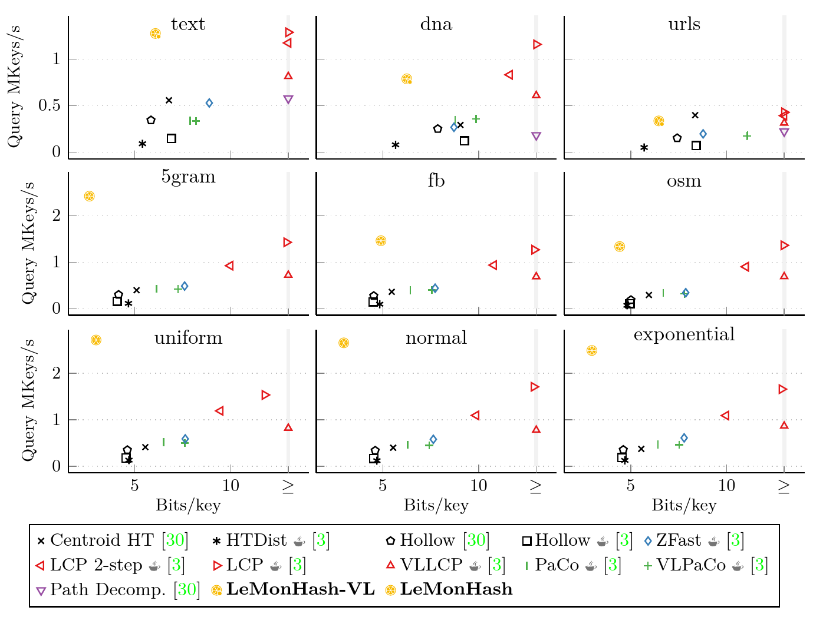

# Learned Monotone Minimal Perfect Hashing

<picture>
  <source media="(prefers-color-scheme: dark)" srcset="img/lemon_wordmark_dark.png">
  
</picture>

[](https://www.gnu.org/licenses/gpl-3.0)


A monotone minimal perfect hash function (MMPHF) maps a set S of n input keys to the first n integers without collisions.
At the same time, it respects the natural order of the input universe.
In other words, it maps each input key to its rank.
MMPHFs have many applications in databases and space-efficient data structures.

LeMonHash (**Le**arned **Mon**otone Minimal Perfect **Hash**ing) is a novel MMPHF that **learns** about regularities in the input data
to achieve significant space and performance improvements.
It uses the [PGM-Index](https://github.com/gvinciguerra/PGM-index) to calculate a learned rank estimate for each key
and then solves collisions between these estimates using the retrieval data structure [BuRR](https://github.com/lorenzhs/BuRR).
Compared to competitors that are mostly based on tree-like data structures, LeMonHash is a lot more flat and therefore faster to query.
LeMonHash dominates most competitors in terms of construction throughput, query throughput, and space consumption -- simultaneously.
We also give a variant for variable-length strings that achieves significantly faster queries than competitors.

### Usage

Requirements:

- GCC 11 or later
- [libxxhash v0.8.0](https://github.com/Cyan4973/xxHash/releases/tag/v0.8.0) or later

Clone the repository (as a submodule) and add the following to your `CMakeLists.txt`.

```cmake
add_subdirectory(path/to/LeMonHash)
target_link_libraries(YourTarget PRIVATE LeMonHash)
```

Then you can use the straight-forward interface of LeMonHash:

```cpp
std::vector<uint64_t> inputData {0, 1, 7, 15, 23, 42, 250};
lemonhash::LeMonHash<> hashFunc(inputData);
for (uint64_t x : inputData) {
    std::cout << x << ": \t" << hashFunc(x) << std::endl;
}
```

### Query performance

[](https://arxiv.org/pdf/2304.11012)

### License

This code is licensed under the [GPLv3](/LICENSE).
If you use the project in an academic context or publication, please cite our [paper](https://arxiv.org/pdf/2304.11012):

```bibtex
@inproceedings{DBLP:conf/esa/FerraginaL0V23,
  author       = {Paolo Ferragina and
                  Hans{-}Peter Lehmann and
                  Peter Sanders and
                  Giorgio Vinciguerra},
  title        = {Learned Monotone Minimal Perfect Hashing},
  booktitle    = {{ESA}},
  series       = {LIPIcs},
  volume       = {274},
  pages        = {46:1--46:17},
  publisher    = {Schloss Dagstuhl - Leibniz-Zentrum f{\"{u}}r Informatik},
  year         = {2023},
  doi          = {10.4230/LIPICS.ESA.2023.46}
}
```

The code of the experiments comparing LeMonHash to competitors from the literature is available [here](https://github.com/ByteHamster/MMPHF-Experiments).
