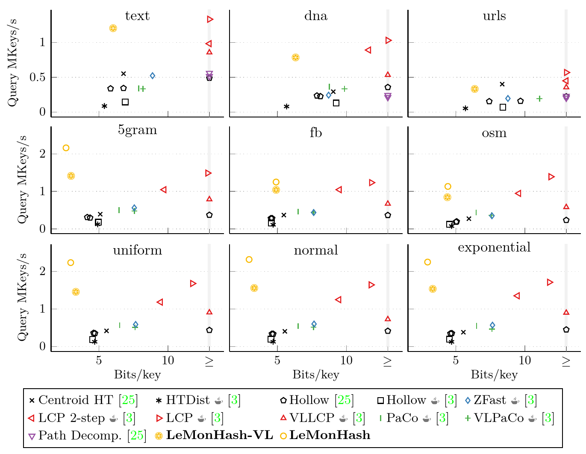

# Learned Monotone Minimal Perfect Hashing


LeMonHash is a Monotone Minimal Perfect Hash function that combines
the [PGM-Index](https://github.com/gvinciguerra/PGM-index) for space-efficient ranking
and [BuRR](https://github.com/lorenzhs/BuRR) for low-overhead retrieval.

A variant for variable-length strings provides significantly faster queries than competitors.



### Requirements

- GCC 11 or later
- [libxxhash v0.8.0](https://github.com/Cyan4973/xxHash/releases/tag/v0.8.0) or later

### Usage

Clone the repository (as a submodule) and add the following to your `CMakeLists.txt`.

```
add_subdirectory(path/to/LeMonHash)
target_link_libraries(YourTarget PRIVATE LeMonHash)
```

Then you can use the straight-forward interface of LeMonHash:

```
std::vector<uint64_t> inputData {0, 1, 7, 15, 23, 42, 250};
lemonhash::LeMonHash<> hashFunc(inputData);
for (uint64_t x : inputData) {
    std::cout << x << ": \t" << hashFunc(x) << std::endl;
}
```

### License

This code is licensed under the [GPLv3](/LICENSE).
If you use the project in an academic context or publication, please cite our paper.
